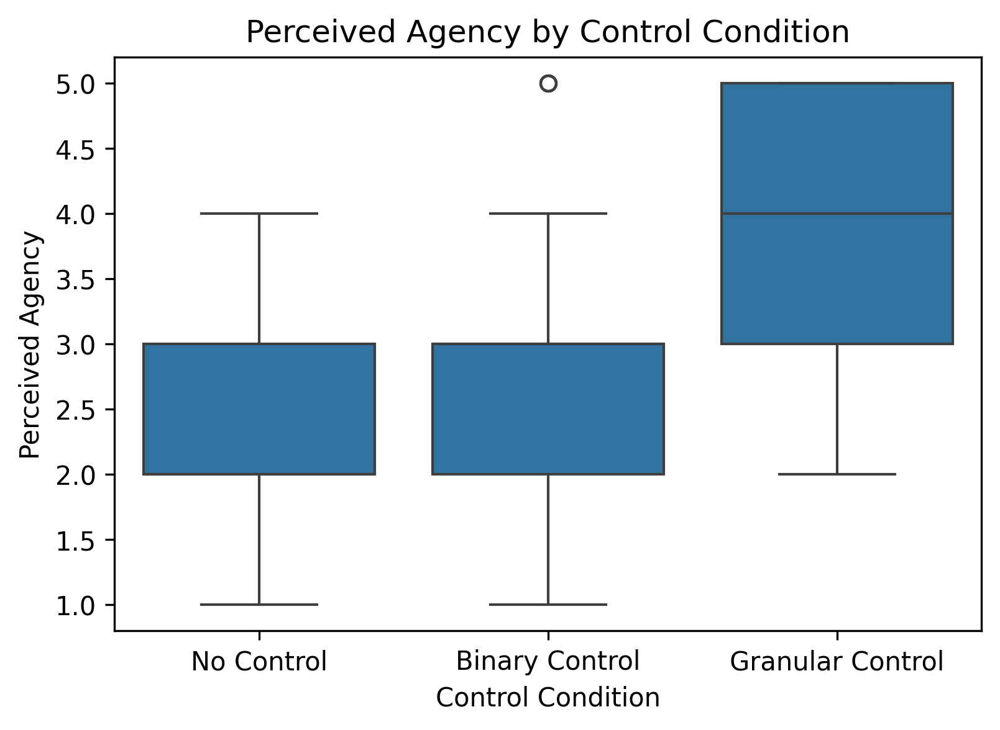
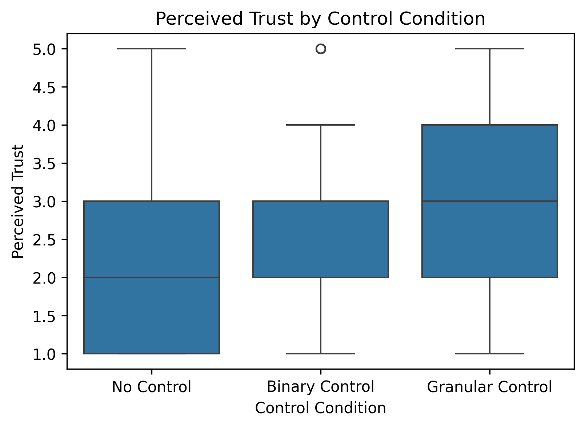
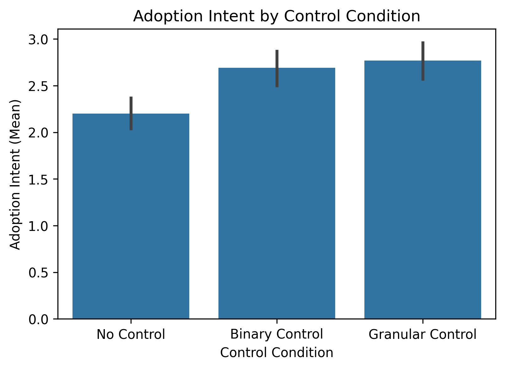

# Ambient AI Control Granularity Study
**Paulina Pluta | February 2026**
*Mini-Project Findings*

---

## 1. Study Objective

Ambient AI is becoming Everywhere AI – and right now, people have no control over it. I call the tools that could change that Human-Side Infrastructure – HSI. Some HSI tools are emerging, but they mainly offer binary control: you're fully visible, or you disappear entirely. There's not much middle ground. My thesis is that binary control is a dead end, and that active, adaptive HSI offering granular control – letting people say 'pause, select, edit' – is what's needed to positively impact comfort, agency, trust, and intent to adopt ambient AI.

Building on prior conceptual work proposing HSI as a necessary layer for ambient AI systems[^1], this exploratory simulation operationalizes that framework in a controlled experimental setting[^2]. The study examines how varying levels of sensing control (none, binary, granular) affect perceived agency, trust, comfort, adoption intent, and system opt-out behavior.

Specifically, the study tests three hypotheses: whether granular control increases perceived agency relative to binary control or no control (H1); whether perceived agency is positively associated with trust and adoption-related outcomes (H2); and whether binary control produces higher rates of full system shutdown compared to granular control (H3).

---

## 2. Experimental Design

The study uses a between-subjects design with 300 synthetic participants, each exposed to only one of three conditions: no control (always-on sensing), binary control (full on/off opt-out), or granular control (modality-level adjustment), resulting in 100 participants per condition.

Participant profiles were randomly generated across three trait dimensions: privacy sensitivity, tech familiarity, and baseline trust. These traits served as inputs to simulate four outcome measures – comfort, perceived agency, perceived trust, and adoption intent – using conceptually motivated weighted relationships reflecting assumptions about how control structures shape agency, trust formation, and willingness to engage. A fifth outcome, binary opt-out behavior, was modeled as a probability-based decision jointly determined by a participant's adoption intent and the control condition they were assigned to, representing full system shutdown or refusal to engage.

---

## 3. Methodology

This project was conducted as a structured exploratory simulation study and learning exercise in computational research workflows. The modeling environment was implemented in Python, using Pandas, NumPy, and Jupyter notebooks for data generation, processing, and visualization, managed within a virtual environment for reproducibility.

The study design was defined in a JSON configuration file, and synthetic participants were generated programmatically to reflect varying trait-level attributes: privacy sensitivity, tech familiarity, and baseline trust. Outcome measures – comfort, perceived agency, perceived trust, and adoption intent – were simulated using conceptually motivated weighted relationships reflecting assumptions about how control structures shape agency, trust formation, and disengagement. Binary opt-out behavior was modeled separately as a probability-based outcome.

AI-assisted development tools, including Cursor, ChatGPT (GPT-5.2) and Claude (Sonnet 4.6), were used to support coding, debugging, structural planning, and clarification of methodological concepts. The overall research direction, theoretical framing, modeling assumptions, and interpretation of results were iteratively developed and critically evaluated by the author.

The project followed a staged workflow: design specification, synthetic data generation, exploratory analysis, and structured interpretation.

---

## 4. Results

### 4.1 Perceived Agency

Granular control produced a clear and substantial increase in perceived agency compared to binary and no-control conditions. Mean agency scores were approximately 4.0 (granular), 3.1 (binary), and 2.0 (no control). This pattern was visually confirmed by boxplot distributions showing clear separation between granular control and the other two conditions, with binary and no-control conditions showing greater overlap with each other (Figure 1).

*Figure 1. Perceived agency by control condition. Boxplots display the distribution of perceived agency ratings (1–5 Likert-type scale) across sensing control conditions. The central line represents the median and boxes indicate the interquartile range. Whiskers extend to the most extreme values within 1.5× the interquartile range; points beyond this range are shown as outliers.*

> Observation: Granularity meaningfully affects perceived agency over sensing.

---

### 4.2 Perceived Trust

Perceived trust showed modest differences across conditions, with considerable overlap in distributions. Mean trust scores were approximately 2.76 (granular), 2.70 (binary), and 2.27 (no control). Differences across conditions were small relative to the separation observed for perceived agency (Figure 2). A Pearson correlation analysis between individual-level perceived agency and perceived trust scores yielded a weak positive association (r ≈ 0.08), suggesting limited downstream amplification of perceived agency into perceived trust within this simulated environment.

*Figure 2. Perceived trust by control condition. Boxplots display the distribution of perceived trust ratings (1–5 Likert-type scale) across sensing control conditions. The central line represents the median and boxes indicate the interquartile range. Whiskers extend to the most extreme values within 1.5× the interquartile range; points beyond this range are shown as outliers.*

> Observation: Perceived trust showed limited sensitivity to control condition, with scores remaining modest across all three groups.

---

### 4.3 Adoption Intent

Adoption intent showed minimal separation across conditions. Mean scores were approximately 2.56 (granular), 2.51 (binary), and 2.28 (no control), with substantial overlap in underlying distributions (Figure 3).

*Figure 3. Adoption intent by control condition. Bar chart displays mean adoption intent (1–5 Likert-type scale) across control conditions. Error bars represent 95% confidence intervals within the simulated dataset.*

> Observation: Granular control did not substantially increase stated willingness to adopt the system relative to other conditions.

---

### 4.4 Opt-out Behavior

Opt-out behavior showed meaningful differentiation across conditions. Binary control produced the highest opt-out rate (≈31%), followed by no control (≈26%), while granular control was associated with substantially lower system shutdown behavior (≈7%) (Figure 4).

*Figure 4. Opt-out rate by control condition. Bar chart displays the proportion of participants fully disabling or refusing the system across sensing control conditions. Error bars represent 95% confidence intervals within the simulated dataset.*

> Observation: Binary control was associated with the highest opt-out rate, while granular control was associated with substantially lower system shutdown behavior.

---

## 5. Emerging Interpretation

Across conditions, granular control produced a substantial increase in perceived agency and a marked reduction in full system opt-out behavior, while only modestly influencing perceived trust and adoption intent. This pattern suggests that the primary function of human-side infrastructure may lie less in amplifying enthusiasm for ambient AI and more in preventing polarization and system rejection.

In this simulated environment, control appears to operate as a stabilizing mechanism – enabling negotiability rather than triggering binary acceptance or abandonment. The substantial reduction in opt-out behavior under granular control highlights its potential role in keeping users engaged with ambient systems rather than withdrawing from them entirely.

These findings offer preliminary, simulation-based support for the conceptual claim in *The Invisible Protocol*: that binary control is a dead end, and that the middle ground – the ability to pause, select, and edit their sensing exposure – may be what determines whether people ultimately live alongside ambient AI or retreat from it.

These findings reflect the conceptual assumptions encoded in the simulation and serve as a theoretical exploration rather than empirical evidence. Future phases will evaluate these assumptions against existing literature and real-world data.

---

[^1]: Pluta, P. (2026). *The Invisible Protocol: Why Ambient AI Needs Human-Side Infrastructure*. Medium. https://medium.com/@paula.pluta/the-invisible-protocol-why-ambient-ai-needs-human-side-infrastructure-9fbb3c1de825

[^2]: *Ambient AI Control Granularity Study*. GitHub. https://github.com/paulapluta/ambient-ai-hsi-mini-study